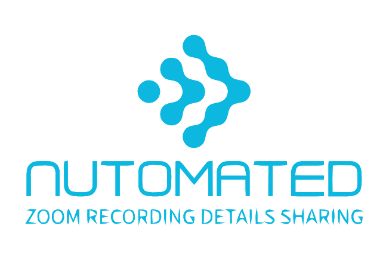
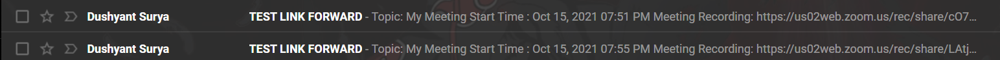
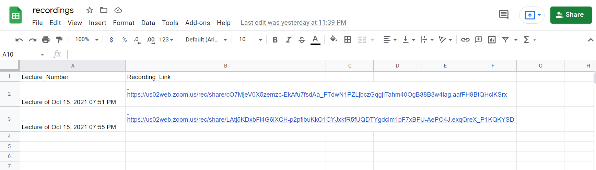

<div id="top"></div>
<!--
*** Thanks for checking out this activity. If you have any suggestion of open source collab ideas.
*** let me know in my email.
-->

<!-- PROJECT LOGO -->
<br />
<div align="center">
  <a href="https://github.com/dcodeforyou/zoom_recording_sharing_automation">
    
  </a>

<h3 align="center">Web-Automation: Zoom Recording Detail Sharing</h3>

  <p align="center">
    Zoom Recording details sharing via web automation.
    <br />
    <a href="https://github.com/dcodeforyou/zoom_recording_sharing_automation"><strong>Docs »</strong></a>
    <br />
  </p>
</div>


<!-- TABLE OF CONTENTS -->
<details>
  <summary>Table of Contents</summary>
  <ol>
    <li>
      <a href="#about-the-project">About The Project</a>
      <ul>
        <li><a href="#built-with">Built With</a></li>
      </ul>
    </li>
    <li>
      <a href="#getting-started">Getting Started</a>
      <ul>
        <li><a href="#prerequisites">Prerequisites</a></li>
        <li><a href="#installation">Installation</a></li>
      </ul>
    </li>
    <li><a href="#usage-results">Usage Results</a></li>
    <li>
      <a href="#roadmap">Roadmap</a>
      <ul>
        <li><a href="#avoided-bot-detection">Avoided bot detection</a></li>
        <li><a href="#automated-sign-in">Automated sign-in</a></li>
        <li><a href="#recordings-scraping">Recordings Scraping</a></li>
        <li><a href="#automated-mail-forward-via-gmail">Automated main forward vis GMail</a></li>
        <li><a href="#automated-spreadsheet-update">Automated spreadsheet update</a></li>
      </ul>
    </li>
    <li><a href="#extra-things-to-try">Extra Things to Try</a></li>
    <li><a href="#contact">Contact</a></li>
  </ol>
</details>


<!-- ABOUT THE PROJECT -->
## About The Project


Hello There!

The intention of this activity was to learn web automation via puppeteer and JavaScript.

In this activity I have created an `automation` script for sharing today's and yesterday's Zoom Recording details over email and update google spreadsheet respectively. 

Here's Why:
* So after late night classes or meetings you don't have to wait for the recording to finish.
* So you can completely forget about sharing the recording details `manually`.
* So you can develop a new feature or chill out instead of waiting for the recording to finish.

<p align="right">(<a href="#top">back to top</a>)</p>


## Built With

<a href="https://nodejs.org/en/">
    
</a>
&nbsp;
&nbsp;
<a href="https://www.javascript.com/">
    
</a>
&nbsp;
&nbsp;
<a href="https://pptr.dev/">
    
</a>
&nbsp;
&nbsp;
<a href="https://developers.google.com/sheets/api">
    
</a>

<p align="right">(<a href="#top">back to top</a>)</p>


<!-- GETTING STARTED -->
## Getting Started

To setup this project locally, you just need to clone this repository and follow these simple <a href="#installation">installation</a> steps. 

### Prerequisites

You need to have [Node](https://www.nodejs.org/) and [npm](https://www.npmjs.com/) installed on your machine.

### Installation

1. Clone the repo with - 
   ```sh
   git clone https://github.com/github_username/repo_name.git
   ```
2. Inside the project root directory install NPM packages with -
   ```sh
   npm install
   ```
3. Create a `.env` file under project root directory and enter your credentials -
   ```sh
   SHEET_ID=google-spreadsheet-id
   GOOGLE_SERVICE_ACCOUNT_EMAIL=service-account-email
   GOOGLE_PRIVATE_KEY=private-key
   GMAIL_EMAIL=gmail-email
   GMAIL_PASSWORD=gmail-password
   ZOOM_EMAIL=zoom-email
   ZOOM_PASSWORD=zoom-password
   ```
4. Create a service account and download credentials json at [Google Developer Console](https://console.cloud.google.com/) and save it under project root directory with name `keys.json`. 
   To setup service account you can refer [here](https://javascript.plainenglish.io/how-to-use-node-js-with-google-sheets-c256c26e10fc).

5. To run the script - 
   * As a cron job (you can change the stop condition as per use)
        ```js
            node cronjob.js
        ```

   * As a stand alone script (args are optional and sign in via gmail is default)
        ```js
            node main.js
            node main.js --via="zoom" 
        ```

<p align="right">(<a href="#top">back to top</a>)</p>


<!-- USAGE EXAMPLES -->
## Usage Results

The result of this activity can be tested with received mails and updated spreadsheet.

 

 

<p align="right">(<a href="#top">back to top</a>)</p>


<!-- ROADMAP -->
## Roadmap

  ## Avoided bot detection
  - [x] Did a little tweak to avoid blocking of google account and untrustworthy browser detection with chrome launcher, axios, puppeteer and userAgent as there are chances of getting detected in puppeteer-stealth mode and incognito mode.
    
  ## Automated Sign-in
  - [x] Automated Zoom login via puppeteer.
  > There are two sign in methods normal Zoom sign in and Gmail sign in. Method can be specified via command line args in [minimist](https://www.npmjs.com/package/minimist) fashion.

  ## Recordings Scraping
  - [x] Scrapped processed zoom recordings via Puppeteer. Filtering of meetings to avoid duplicate meetings. 

  ## Automated mail forward via GMail
  - [x] Forwards the mail via your GMail account to the address mentioned in .env.

  ## Automated spreadsheet update
  - [x] After sending mail, google spreadsheet with mentioned spreadsheet id will be updated with recording detail.

  ## Script as a CronJob
  - [x] Script can be repeatedly run as a cronjob so if there is some meeting still in processing can be shared in next iteration.

<p align="right">(<a href="#top">back to top</a>)</p>


<!-- EXTRA -->
## Extra Things to Try

 * You can change cron job conditions to schedule and stop the script.
 * You can set recording details sharing constraints.
 * You can set cronjob script in scheduler to automatically run the script as a cronjob.

<p align="right">(<a href="#top">back to top</a>)</p>


<!-- CONTACT -->
## Contact

Dushyant Surya - dcodeforyou@gmail.com

Activity Link: [https://github.com/dcodeforyou/zoom_recording_sharing_automation](https://github.com/dcodeforyou/zoom_recording_sharing_automation)

<p align="right">(<a href="#top">back to top</a>)</p>

